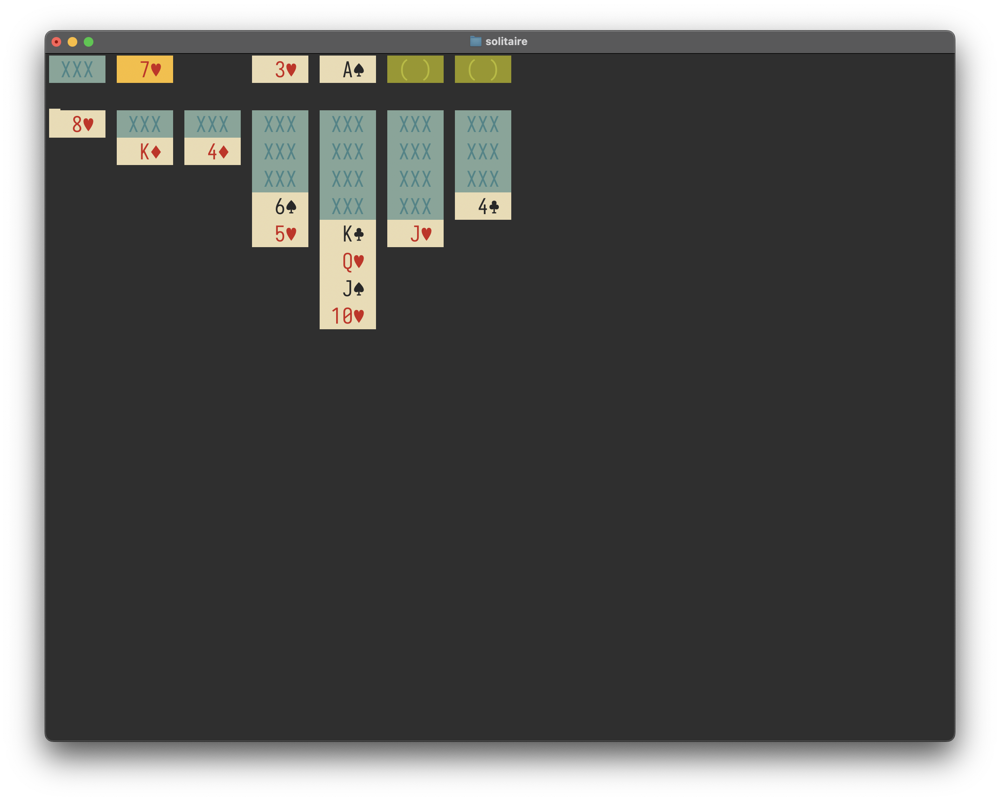

# Solitaire

A small, terminal based game of Solitaire written in [Rust](https://www.rust-lang.org).

## How to play

Space and Return keys selects/releases cards, or distributes from the deck.  
Arrow keys move between the piles and within them.  
Q and Escape keys quits the game.
N starts a new game.
